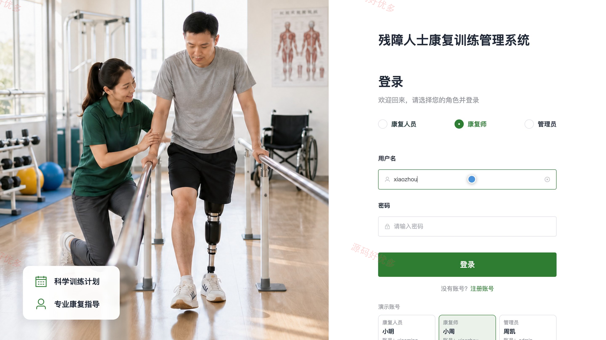
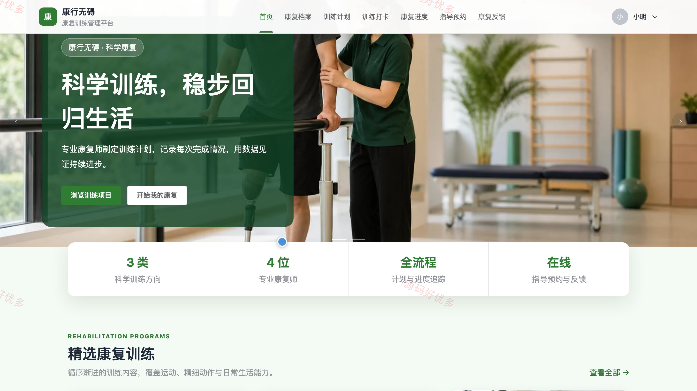
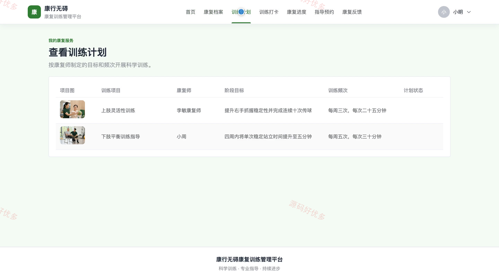
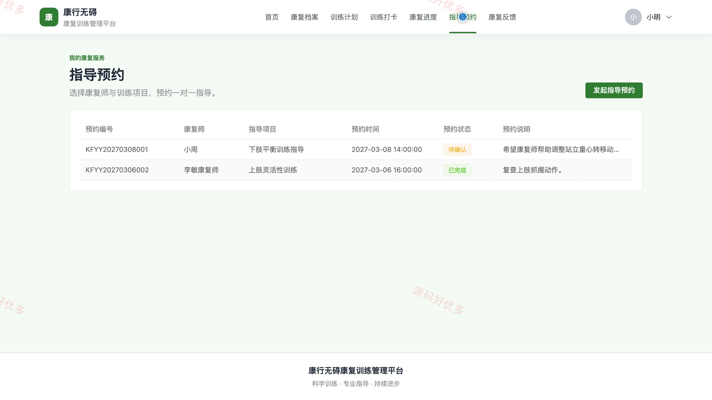
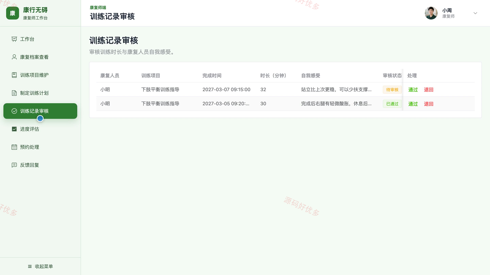
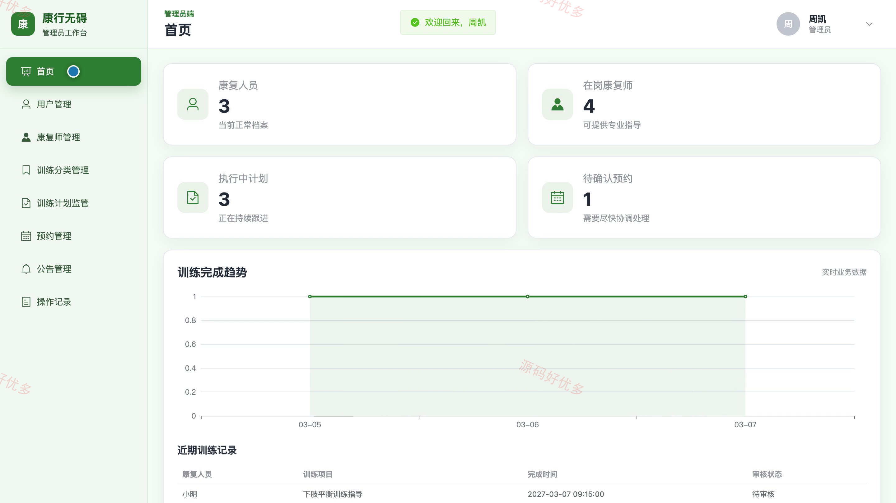
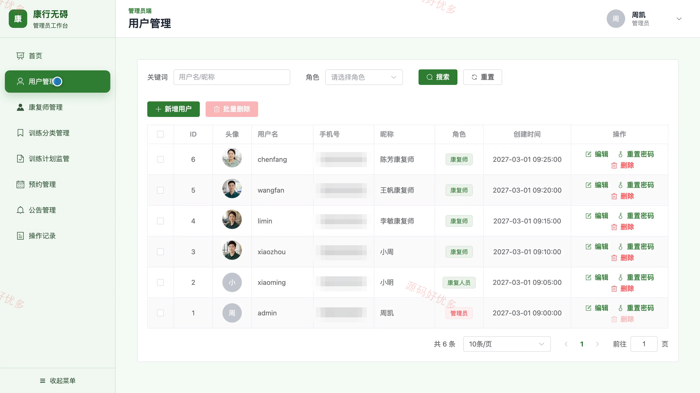

# bs096A
bs096A残障人士康复训练管理系统
## 源码问题查看主页咨询

### 一、关键词
康复训练、康复管理、训练打卡、进度评估、康复指导

### 二、作品包含
源码+数据库+万字设计文档+PPT+全套环境和工具资源+本地部署教程

### 三、项目技术
前端技术： Html、Css、Js、Vue3.4、Element-Plus
后端技术：Java、SpringBoot3.2.0、MyBatis-Plus

### 四、运行环境（以下版本亲测，其他版本兼容性请自行测试）
开发工具：IDEA/eclipse + VSCODE

数据库：MySQL5.7+（共14张表）

数据库管理工具：Navicat10以上版本

环境配置软件： JDK17 + Maven

前端Nodejs：16+

浏览器：谷歌浏览器

### 五、项目介绍
项目编号：bs096A

系统面向康复人员、康复师和管理员，围绕康复档案、训练项目、训练计划、日常打卡、进度评估、指导预约与反馈回复形成连续的康复训练管理流程，并支持账号、训练分类、公告和操作记录的统一维护。

角色：康复人员、康复师、管理员

康复人员功能：账号注册与登录、康复档案查看、训练项目浏览、个人训练计划查看、训练打卡记录、康复进度查看、指导预约提交、康复反馈与账户维护。

康复师功能：康复工作台查看、康复档案查看、训练项目维护、训练计划制定、训练记录审核、康复进度评估、指导预约处理、康复反馈回复。

管理员功能：平台数据统计、康复人员账号管理、康复师账号管理、训练分类管理、训练计划监管、指导预约管理、公告信息管理、操作记录查看。

### 六、运行截图

